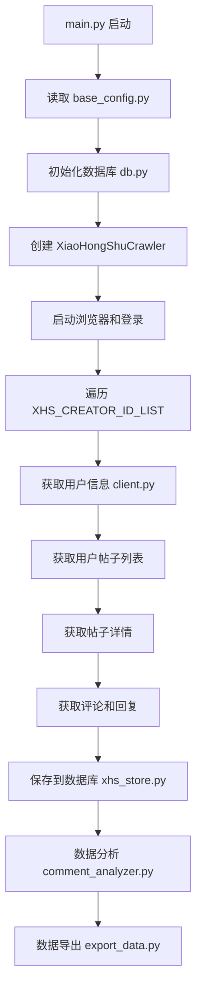

# MediaCrawler 项目文件结构完整图谱

## 📁 项目目录结构详解

```
f:\Python\MediaCrawler-main\
│
├── 📄 main.py                          # 程序入口文件
├── 📄 db.py                            # 数据库连接和操作管理
├── 📄 async_db.py                      # 异步数据库操作类
├── 📄 var.py                           # 全局变量定义
├── 📄 requirements.txt                 # Python依赖包列表
├── 📄 pyproject.toml                   # 项目配置文件
├── 📄 README.md                        # 项目说明文档
├── 📄 如何获取小红书用户ID.md         # 用户ID获取指南
├── 📄 项目代码结构详解.md             # 代码结构说明
├── 📄 项目核心功能详解.md             # 功能详解文档
│
├── 📁 config/                          # 配置模块
│   ├── 📄 __init__.py                  # 配置导入
│   ├── 📄 base_config.py              # 基础配置（用户ID、爬取参数等）
│   └── 📄 db_config.py                # 数据库配置
│
├── 📁 cmd_arg/                         # 命令行参数处理
│   ├── 📄 __init__.py
│   └── 📄 arg.py                       # 参数解析逻辑
│
├── 📁 base/                            # 基础抽象类
│   ├── 📄 __init__.py
│   └── 📄 base_crawler.py             # 爬虫抽象基类
│
├── 📁 media_platform/                  # 媒体平台实现
│   ├── 📄 __init__.py
│   └── 📁 xhs/                        # 小红书平台实现
│       ├── 📄 __init__.py
│       ├── 📄 core.py                 # 🔥 爬虫核心逻辑
│       ├── 📄 client.py               # 🔥 API客户端实现
│       ├── 📄 login.py                # 🔥 登录管理
│       ├── 📄 field.py                # 数据字段定义
│       ├── 📄 exception.py            # 异常定义
│       └── 📄 help.py                 # 辅助函数（签名算法等）
│
├── 📁 store/                           # 数据存储模块
│   ├── 📄 __init__.py
│   └── 📁 xhs/                        # 小红书数据存储
│       ├── 📄 __init__.py
│       └── 📄 xhs_store.py            # 🔥 数据保存逻辑
│
├── 📁 model/                           # 数据模型定义
│   ├── 📄 __init__.py
│   └── 📄 m_xiaohongshu.py           # 小红书数据模型类
│
├── 📁 schema/                          # 数据库表结构
│   └── 📄 tables.sql                  # 🔥 MySQL表结构定义
│
├── 📁 tools/                           # 工具模块
│   ├── 📄 __init__.py
│   ├── 📄 browser_launcher.py         # 浏览器启动器
│   ├── 📄 cdp_browser.py             # CDP浏览器控制
│   ├── 📄 crawler_util.py            # 爬虫工具函数
│   ├── 📄 time_util.py               # 时间处理工具
│   ├── 📄 utils.py                   # 通用工具函数
│   ├── 📄 words.py                   # 文本处理工具
│   ├── 📄 easing.py                  # 动画缓动函数
│   └── 📄 slider_util.py             # 滑块验证工具
│
├── 📁 proxy/                           # 代理管理
│   ├── 📄 __init__.py
│   ├── 📄 base_proxy.py              # 代理基类
│   ├── 📄 proxy_ip_pool.py           # IP代理池
│   ├── 📄 types.py                   # 代理类型定义
│   └── 📁 providers/                 # 代理提供商实现
│
├── 📁 libs/                            # 第三方库文件
│   ├── 📄 stealth.min.js             # 🔥 反检测JavaScript
│   ├── 📄 douyin.js                  # 抖音相关JS（已移除）
│   └── 📄 zhihu.js                   # 知乎相关JS（已移除）
│
├── 📁 docs/                            # 文档资源
│   ├── 📄 hit_stopwords.txt          # 停用词文件
│   ├── 📄 STZHONGS.TTF               # 中文字体文件
│   └── 📁 static/images/             # 静态图片资源
│
├── 📁 data/                            # 数据输出目录
│   ├── 📄 xhs_notes_20250101.csv     # 导出的帖子数据
│   ├── 📄 xhs_comments_20250101.csv  # 导出的评论数据
│   ├── 📄 creators_data.json         # 创作者数据
│   ├── 📄 notes_data.json            # 帖子数据
│   ├── 📄 comments_data.json         # 评论数据
│   ├── 📄 structured_comments_data.json # 结构化评论数据
│   └── 📄 data_statistics_report.txt # 数据统计报告
│
├── 📁 test/                            # 测试文件
│   ├── 📄 __init__.py
│   ├── 📄 test_expiring_local_cache.py
│   ├── 📄 test_proxy_ip_pool.py
│   ├── 📄 test_redis_cache.py
│   └── 📄 test_utils.py
│
├── 📁 cache/                           # 缓存目录
├── 📁 browser_data/                    # 浏览器数据目录
├── 📁 __pycache__/                     # Python缓存文件
├── 📁 .venv/                          # 虚拟环境
└── 📁 .git/                           # Git版本控制
│
└── 📄 自定义分析脚本：
    ├── 📄 export_data.py              # 🔥 数据导出工具
    ├── 📄 view_data.py                # 数据查看工具
    ├── 📄 view_data_fixed.py          # 修复版数据查看
    ├── 📄 comment_analyzer.py         # 🔥 评论分析工具
    ├── 📄 comment_tree_visualizer.py  # 🔥 评论树可视化
    ├── 📄 comment_tree_analyzer.py    # 评论树分析
    ├── 📄 comment_visualization.py    # 评论可视化
    ├── 📄 database_optimizer.py       # 数据库优化工具
    └── 📄 network_test.py             # 网络连接测试
```

## 🎯 核心文件功能说明

### 🔥 关键核心文件

| 文件 | 功能描述 | 重要程度 |
|------|----------|----------|
| `main.py` | 程序入口，整个流程的起点 | ⭐⭐⭐⭐⭐ |
| `config/base_config.py` | 用户配置文件，包含用户ID列表 | ⭐⭐⭐⭐⭐ |
| `media_platform/xhs/core.py` | 爬虫核心逻辑，创作者爬取流程 | ⭐⭐⭐⭐⭐ |
| `media_platform/xhs/client.py` | API客户端，与小红书接口交互 | ⭐⭐⭐⭐⭐ |
| `media_platform/xhs/login.py` | 登录管理，支持多种登录方式 | ⭐⭐⭐⭐⭐ |
| `store/xhs/xhs_store.py` | 数据存储，保存到数据库 | ⭐⭐⭐⭐⭐ |
| `schema/tables.sql` | 数据库表结构定义 | ⭐⭐⭐⭐ |
| `libs/stealth.min.js` | 反检测JavaScript脚本 | ⭐⭐⭐⭐ |

### 📊 数据分析工具

| 文件 | 功能描述 | 用途 |
|------|----------|------|
| `export_data.py` | 数据导出为CSV/JSON | 数据备份和分析 |
| `comment_analyzer.py` | 评论数据统计分析 | 了解评论概况 |
| `comment_tree_visualizer.py` | 评论树关系可视化 | 分析评论互动关系 |
| `view_data.py` | 查看数据库中的数据 | 验证爬取结果 |

### 🔧 辅助工具文件

| 文件 | 功能描述 | 用途 |
|------|----------|------|
| `db.py` | 数据库连接和操作 | 数据持久化 |
| `tools/browser_launcher.py` | 浏览器启动和管理 | 自动化控制 |
| `tools/utils.py` | 通用工具函数 | 公共功能支持 |
| `proxy/proxy_ip_pool.py` | 代理IP池管理 | 反反爬虫 |

## 🚀 使用流程图



## 🎮 快速上手指南

### 1. **配置用户ID**
编辑 `config/base_config.py`：
```python
XHS_CREATOR_ID_LIST = [
    "你要爬取的用户ID",  # 从用户主页URL获取
]
```

### 2. **运行爬虫**
```bash
python main.py
```

### 3. **查看数据**
```bash
python view_data.py          # 查看数据库中的数据
python export_data.py        # 导出数据到文件
python comment_analyzer.py   # 分析评论数据
```

### 4. **可视化分析**
```bash
python comment_tree_visualizer.py  # 生成评论树可视化
```

## 💡 项目特色

- **专注性**: 专门针对小红书平台优化
- **完整性**: 支持用户→帖子→评论→回复的完整数据链
- **稳定性**: 多层反检测机制，登录状态保持
- **扩展性**: 模块化设计，易于功能扩展
- **分析性**: 内置丰富的数据分析工具

这个项目通过精心设计的文件结构和模块划分，实现了一个功能完整、易于使用的小红书数据采集和分析系统。
